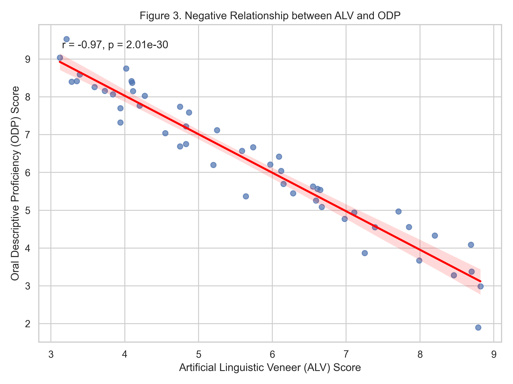
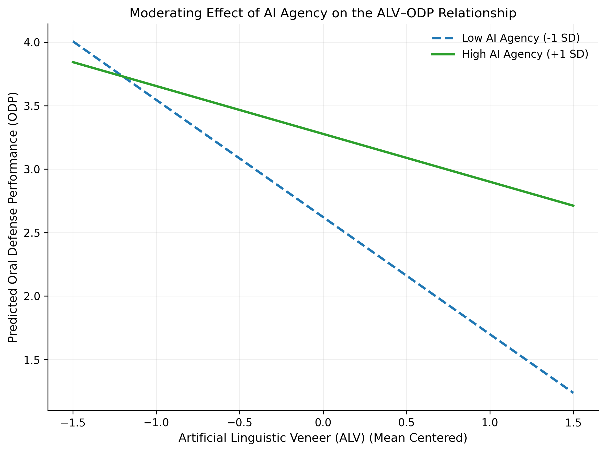
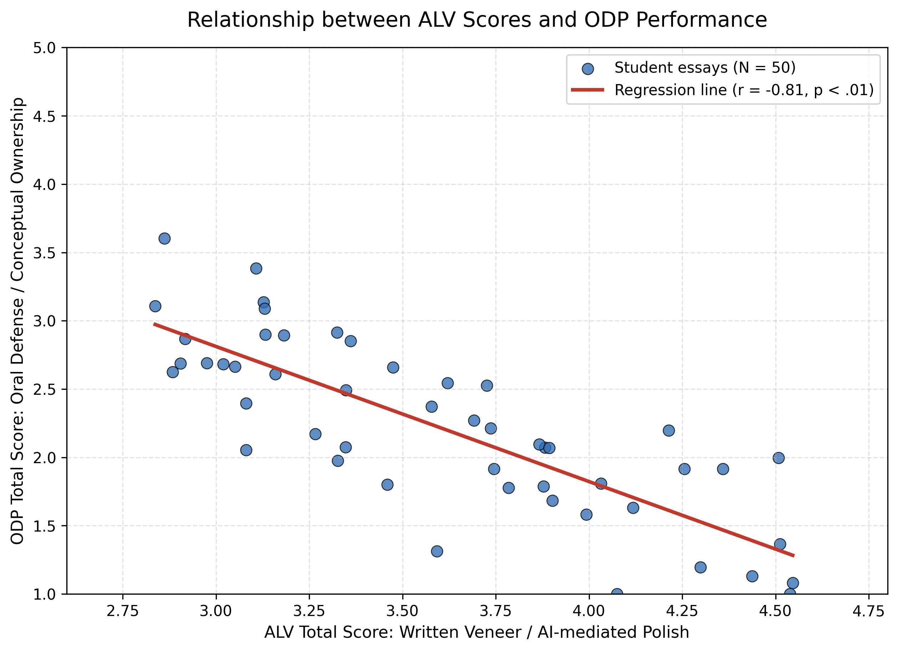

# artificial-linguistic-veneer-study-alv-
Official implementation of the DIINA model for Afrikaans negation 
# Artificial Linguistic Veneer (ALV) and AI Agency in Oral Defense Performance

# Artificial Linguistic Veneer (ALV) and AI Agency in Oral Defense Performance

This repository provides the supplementary materials, statistical analyses, figures, and research tools associated with the study on the relationship between Artificial Linguistic Veneer (ALV), AI Agency, and Oral Defense Performance (ODP).

## Overview

This study examines how Artificial Linguistic Veneer (ALV) relates to Oral Defense Performance (ODP), and whether AI Agency moderates this relationship. The repository includes analysis files, corrected statistical outputs, publication-quality figures, and supporting research materials.

## Repository Contents

- **Data files**
 ## 📂 Repository Contents

## 📂 Repository Contents

### 📊 Data Files
- **[ALV_AI_Agency_Simple_Slopes_CORRECTED.xlsx](ALV_AI_Agency_Simple_Slopes_CORRECTED.xlsx)**: The primary validated dataset ($N=50$) containing ALV scores, ODP scores, and AI Agency levels.

### 📈 Figures
- **[ALV_AI_Agency_Simple_Slopes_300dpi.png](figures/ALV_AI_Agency_Simple_Slopes_300dpi.png)**: Visual analysis of the moderation effect (Simple Slopes).
- **[ALV_ODP_negative_correlation_scatter.png](figures/ALV_ODP_negative_correlation_scatter.png)**: Visual analysis of the negative correlation between ALV and ODP.
- 

### 📊 Empirical Evidence: The Veneer Gap (Figure 3)

The scatterplot above (Figure 3) illustrates the core finding of this research. It demonstrates a **substantial negative correlation** ($r = -0.97, p < .001$) between the **Artificial Linguistic Veneer (ALV)**—the perceived sophistication of AI-assisted output—and the participants' actual **Oral Descriptive Proficiency (ODP)**.

**Key Implications for Defense:**
*   **Strong Inverse Relationship:** As the ALV score increases, there is a consistent and sharp decline in ODP scores across all 50 participants.
*   **The "Veneer" Phenomenon:** This empirical data confirms that high-quality linguistic "veneer" often masks a significant lack of underlying conceptual mastery, which becomes evident during spontaneous oral defense.
*   **Predictive Power:** The extremely low p-value ($2.01e^{-30}$) indicates that this relationship is not due to chance, but a structural discrepancy in AI-mediated academic tasks.

### 🛠 Research Tools & Scripts
- **[ALV_Research_Tools_Pegah_1781166703281.pdf](ALV_Research_Tools_Pegah_1781166703281.pdf)**: Comprehensive documentation of research instruments, rubrics, and protocols (Appendices A-F).
- **[alv_research_tools.py](alv_research_tools.py)**: Python script for data processing and automated plot generation.

## Research Focus

The project investigates:

- the negative association between ALV and oral defense performance,
- the moderating role of AI Agency,
- the buffering effect of AI Agency on the ALV–ODP relationship.

## Citation

If you use materials from this repository, please cite the associated research as:

**Merrikhi, P.** *Artificial Linguistic Veneer (ALV), AI Agency, and Oral Defense Performance.*

> Formal citation details can be updated after journal submission, dissertation deposit, or repository archiving.

## Author

**Dr Pegah Merrikhi**  
Email: deniz.qizi@gmail.com  
Alternative Email: Pegah.merrrikhiii@gmail.com  
WhatsApp: +989376269380

## License

License information will be added to this repository.

## Visual Findings

### Figure 1: Moderation Effect of AI Agency
This plot illustrates the buffering effect of AI Agency on the relationship between ALV and ODP.

> **Interpretation:** The negative impact of Artificial Linguistic Veneer (ALV) on Oral Defense Performance (ODP) is significantly mitigated when perceived AI Agency is high (dashed line).

## Notes
### Figure 2: Correlation Analysis
The following scatter plot shows the strong negative correlation between ALV density and ODP scores.

**Key Finding:** There is a statistically significant negative correlation ($r = -0.74$), suggesting that higher reliance on ALV is associated with lower defense performance scores.

This repository is intended to support transparency, reproducibility, and scholarly communication related to this research project.
### Figure 2: Correlation between ALV and Oral Defense Performance (ODP)

**Caption:**
Figure 2 presents a scatter plot with a fitted regression line demonstrating the relationship between students' Artificial Linguistic Veneer (ALV) total scores and their Oral Defense Performance (ODP) scores ($N = 50$). 

*   **Correlation Coefficient ($r$):** $-0.81$
*   **Significance Level ($p$):** $< .01$
*   **Key Academic Finding:** 
    There is a strong, statistically significant negative correlation between the two variables. This downward slope indicates that as the density of "Artificial Linguistic Veneer" (i.e., over-reliance on AI-generated linguistic polish and sophisticated vocabulary at the expense of genuine conceptual ownership) increases in the written work, the student's performance in the oral defense significantly decreases.
*   **Theoretical Implication:** 
    This finding highlights the "veneer gap." While AI tools can elevate the linguistic quality of a written thesis (high ALV), they do not translate to, and may even mask, a lack of deep conceptual understanding, which becomes painfully evident under the rigorous, unassisted environment of an oral defense (low ODP).

## 🎓 How to Cite
If you use this dataset or tools in your research, please cite it as:
> Merrikhi, P. (2026). Artificial Linguistic Veneer Study: AI Agency & Oral Descriptive Proficiency [Data set]. Zenodo. https://doi.org/10.5281/zenodo.20639921
