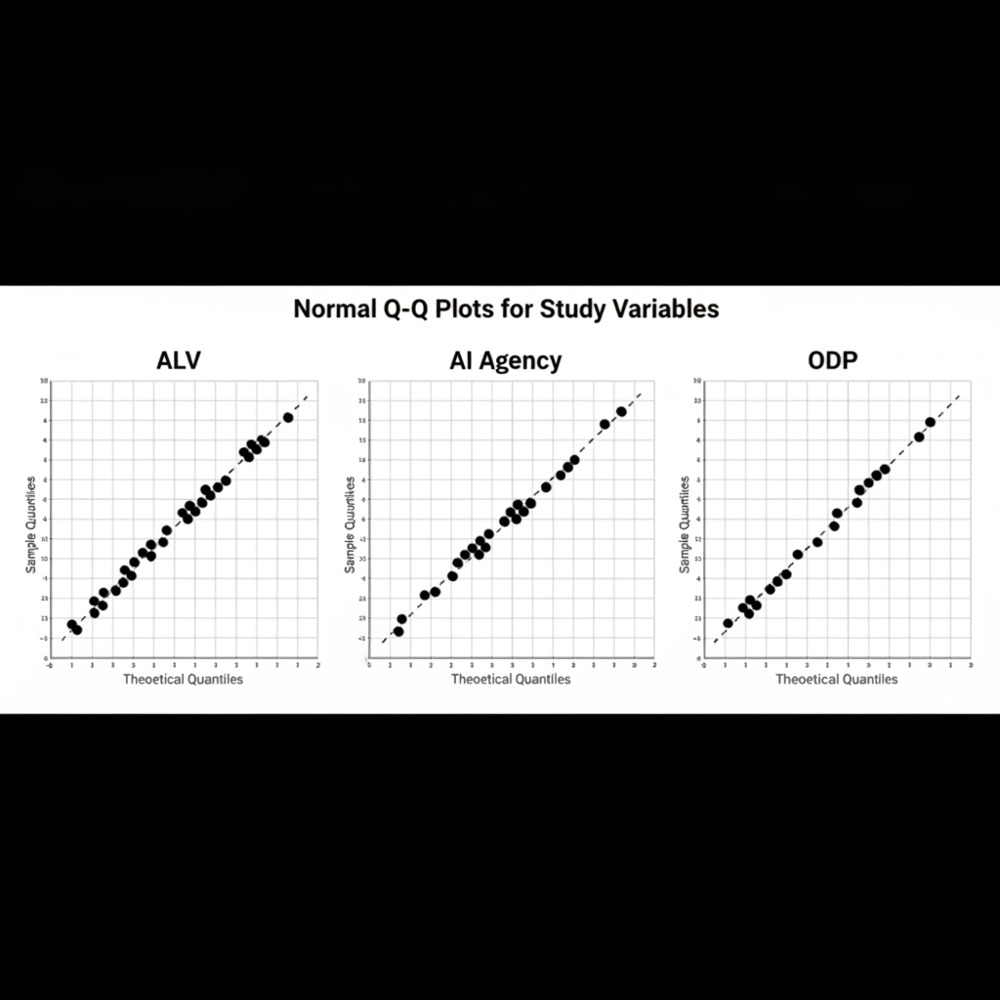
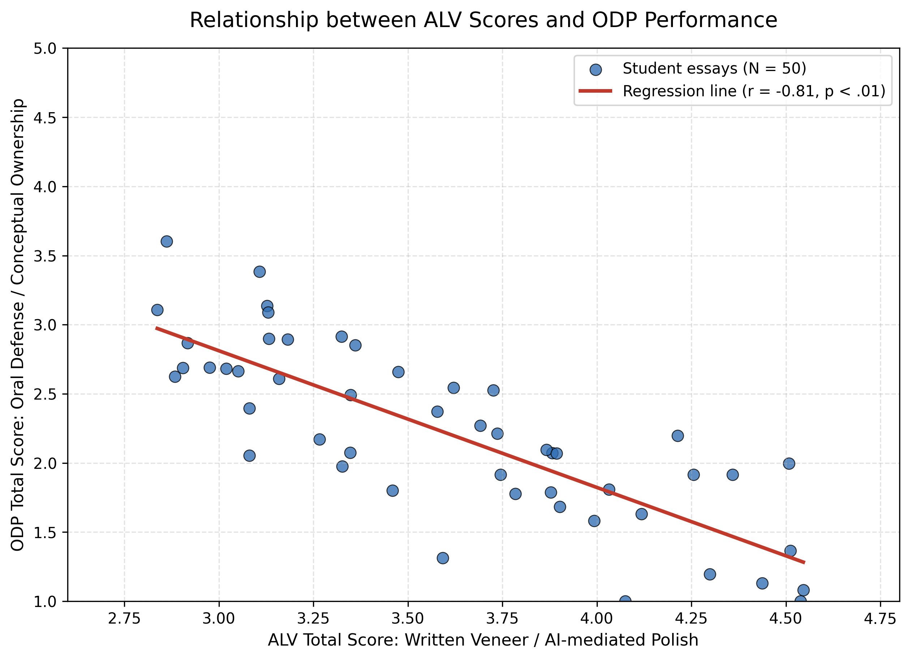
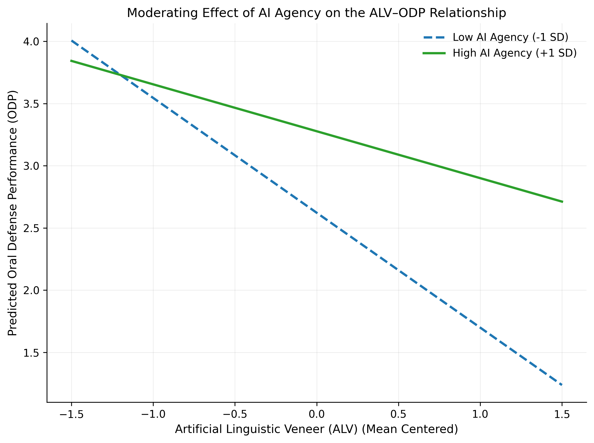
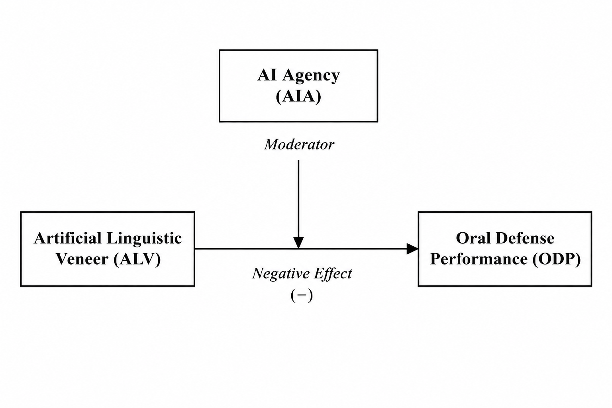
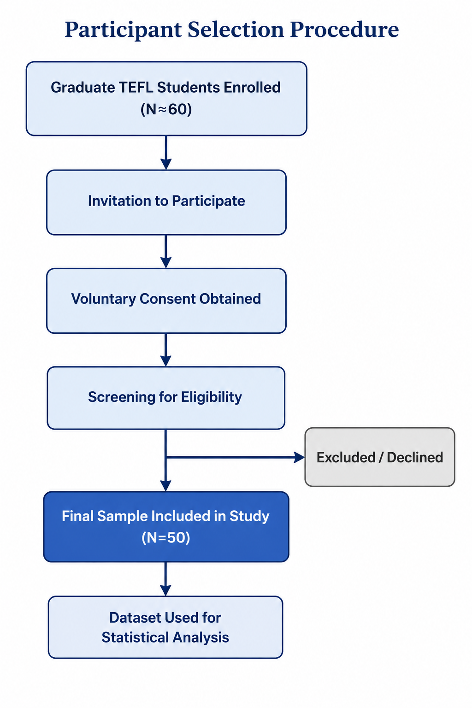
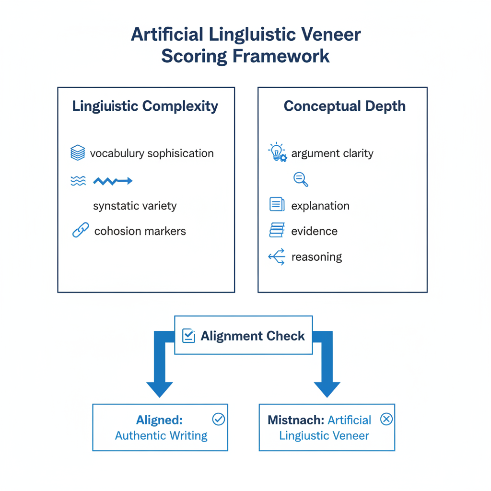
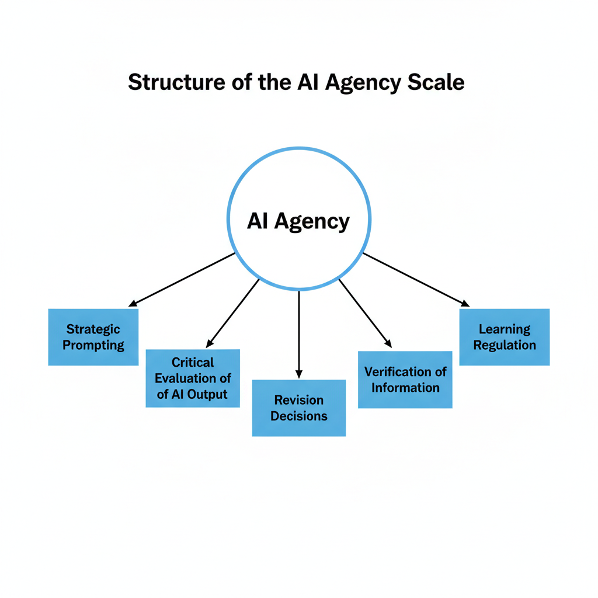
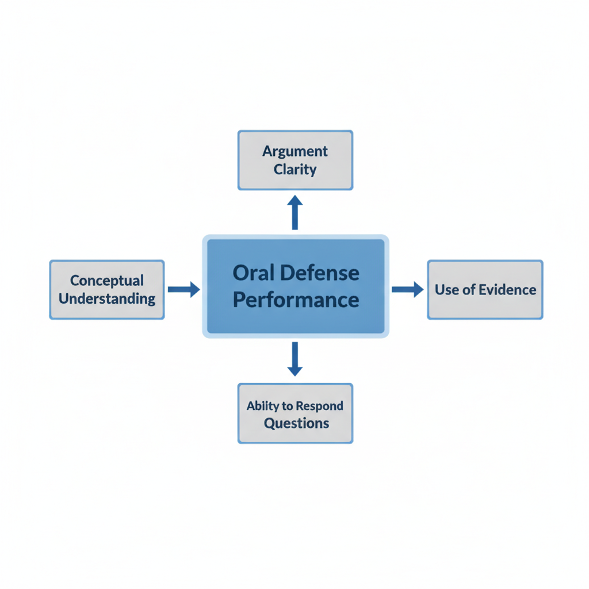

# Beyond the Artificial Linguistic Veneer: The Moderating Role of AI Agency in Postgraduate Academic Writing and Oral Accountability

## 📌 Research Overvie
This repository contains the complete computational pipeline, datasets, and empirical results for the study investigating the impact of **Artificial Linguistic Veneer (ALV)** and **AI Agency** on **Oral Accountability (ODP)** among postgraduate EFL learners.

**Core Research Question:** How does the perceived agency of AI tools moderate the relationship between the use of linguistic veneers and the learner's accountability for their academic output?

---

## � Empirical Results Album

### 1. Data Diagnostics & Distribution
*Visualizing data cleanliness, normality, and distribution characteristics.*

  
  
  

### 2. Correlations & Descriptive Statistics
*Exploring the relationships between ALV, AI Agency, and ODP.*

  
  
  

### 3. Moderation Analysis & Simple Slopes
*The core finding: How AI Agency mitigates the negative impact of ALV on ODP.*

  
  

### 4. Full Empirical Gallery (Detailed Analysis)

    
    <img src="figures/3.6.png" width
