# ARtificial Linguistic Veneer Study (ALV)

## 📊 Research Visuals & Empirical Results

### 1. Data Cleaning & Diagnostics
  

### 2. Correlation & Descriptives
  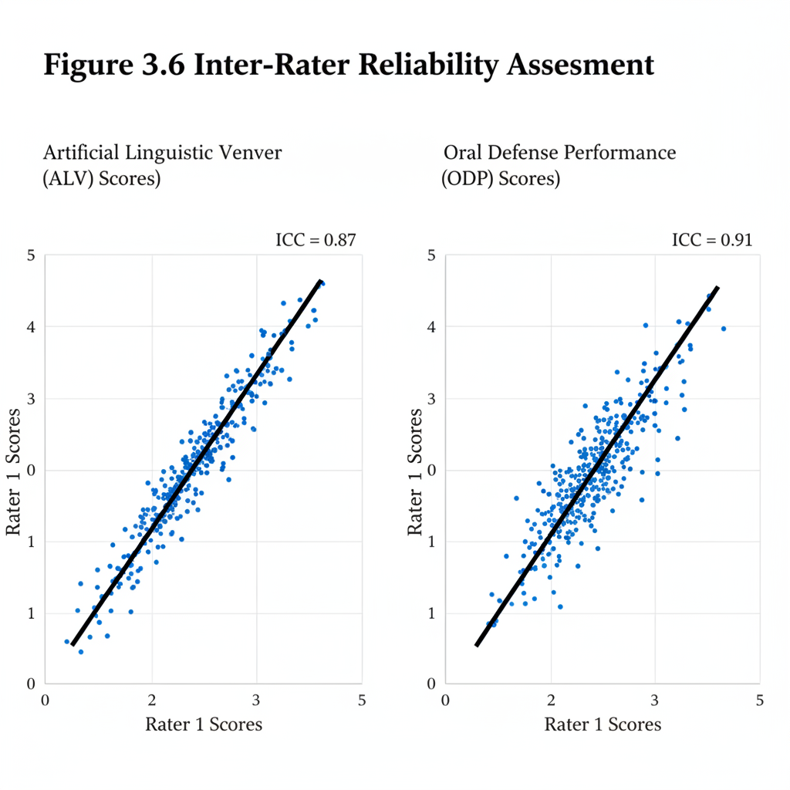

### 3. Further Diagnostics
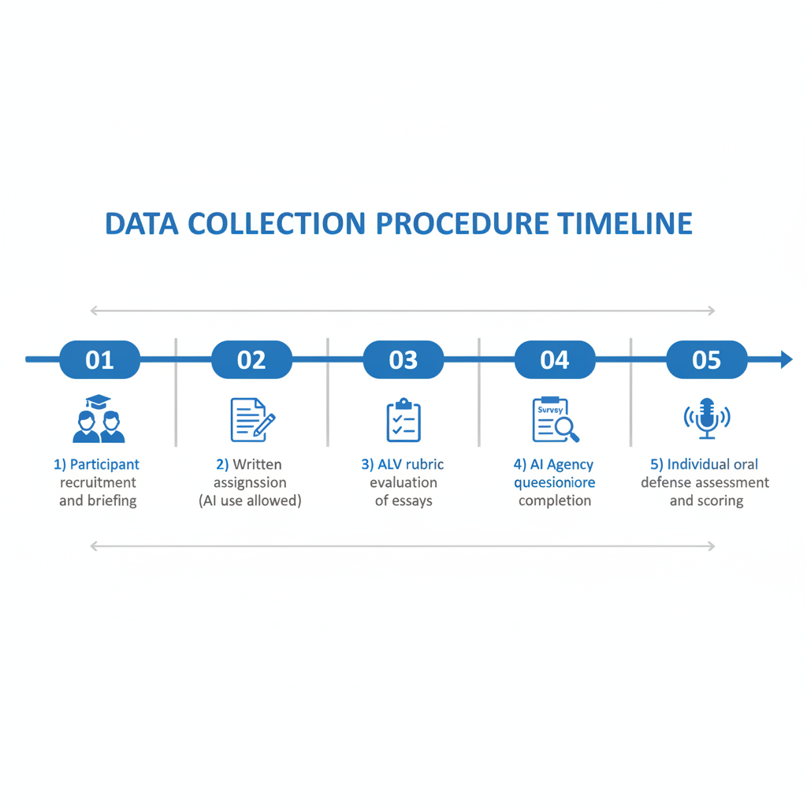 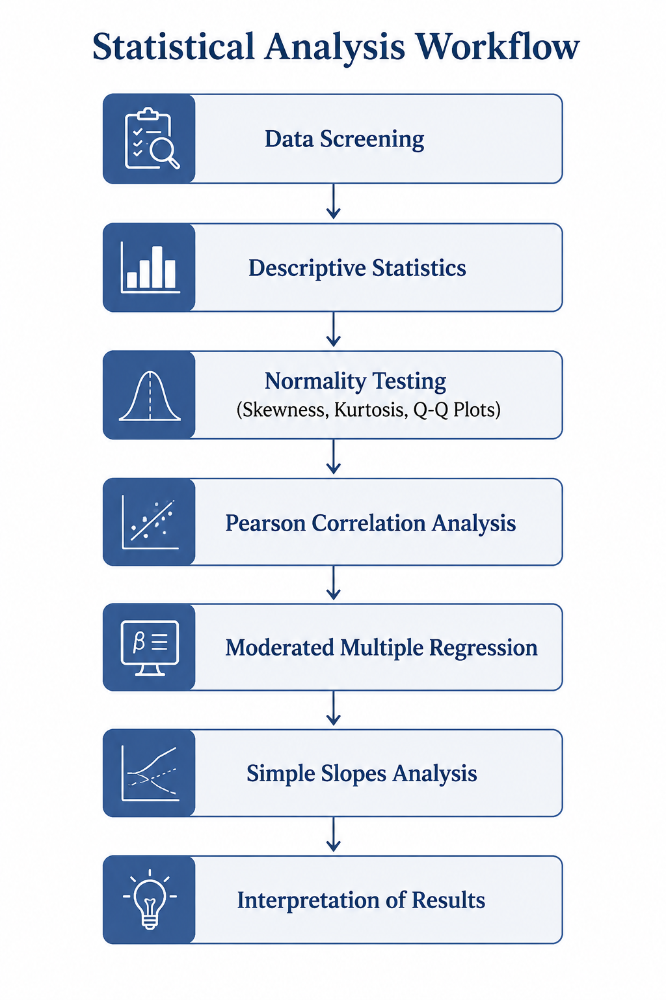 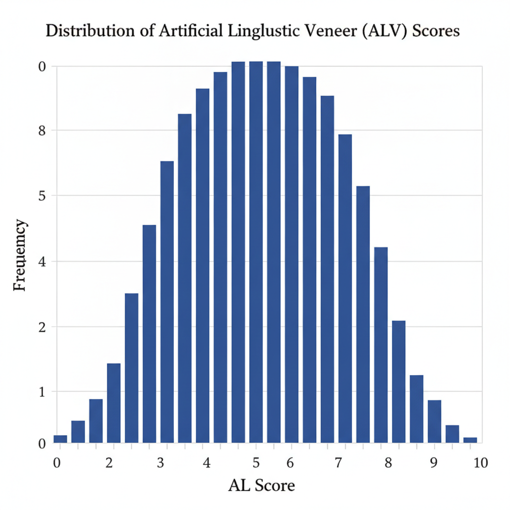

### 4. Main Analysis
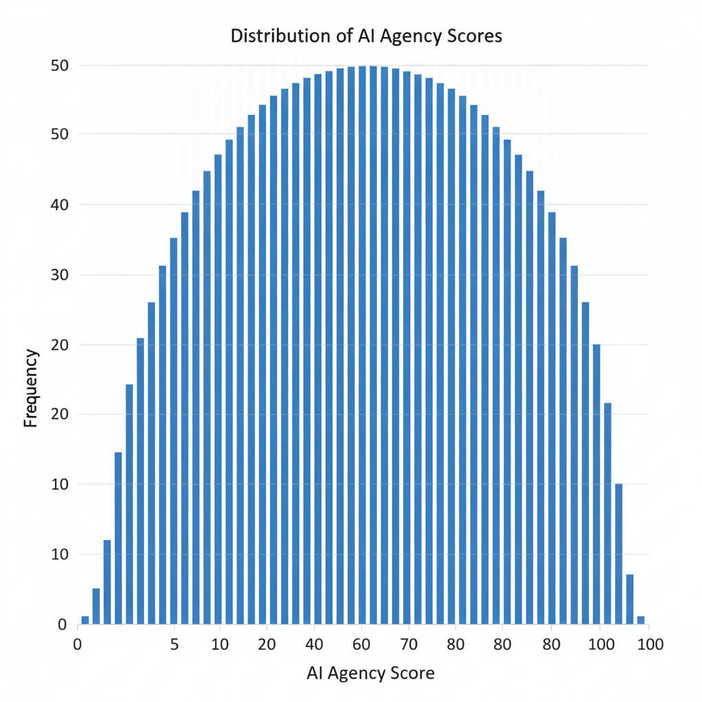  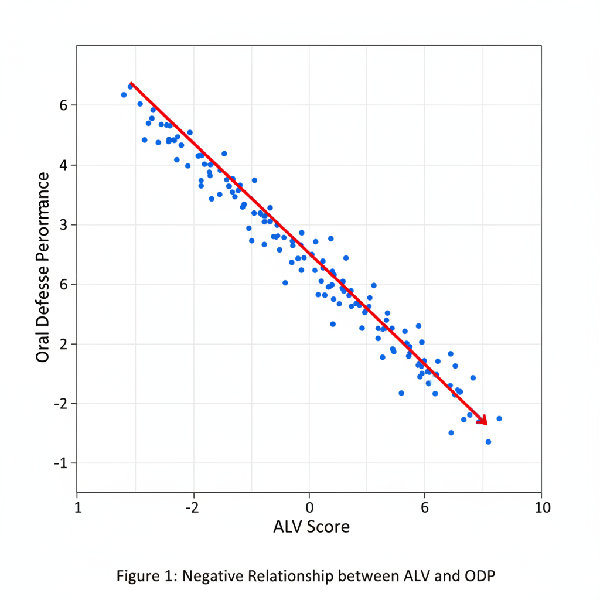

### 5. Moderation Results
 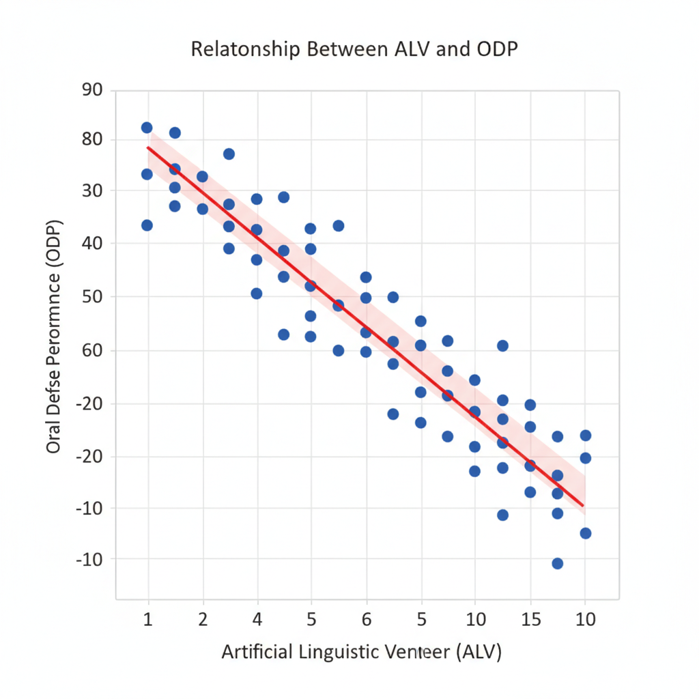 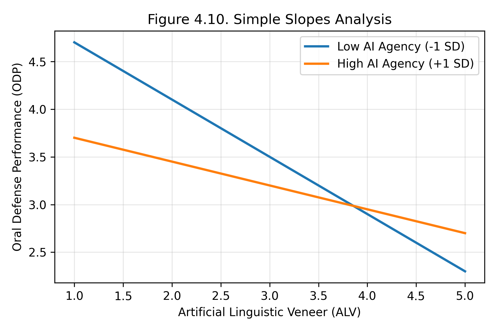

### 6. Final Models
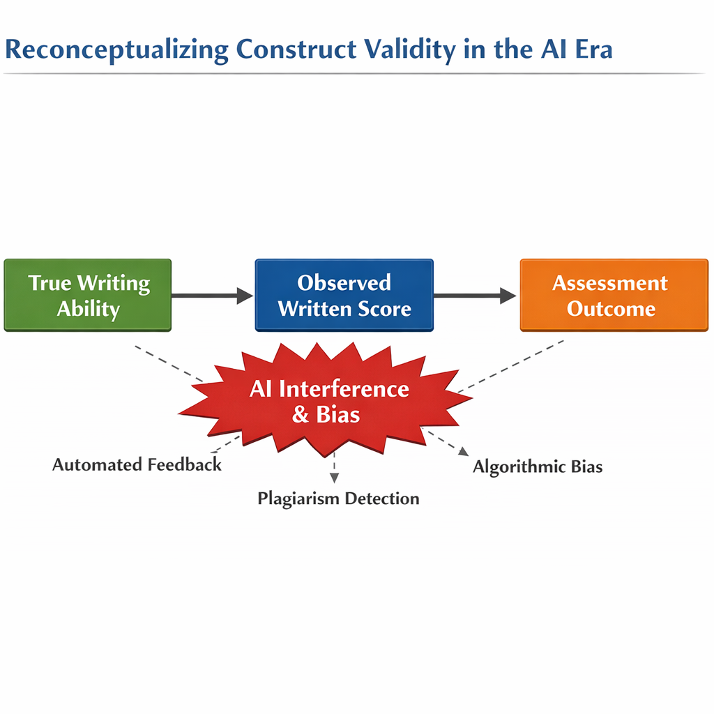 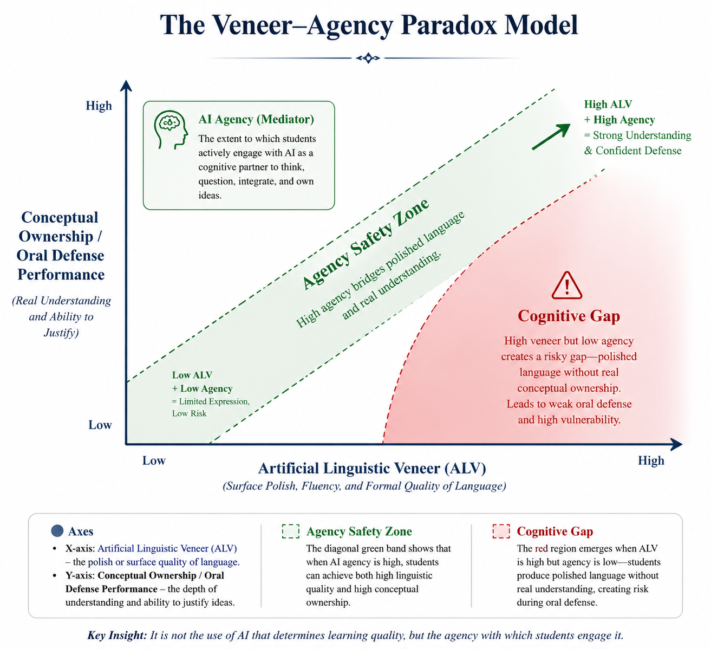 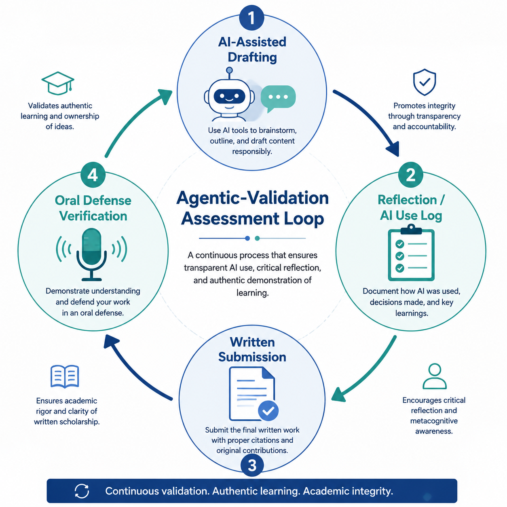
