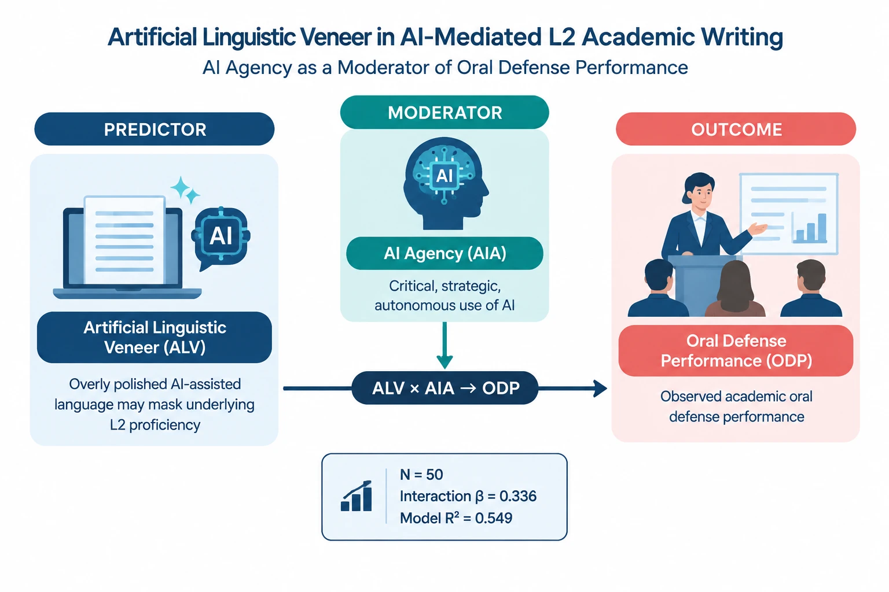

# Artificial Linguistic Veneer in AI-Mediated L2 Academic Writing: The Moderating Role of Student AI Agency in Predicting Oral Defence Performance

[](https://doi.org/10.5281/zenodo.placeholder)
[](https://opensource.org/licenses/MIT)
[](https://www.python.org/)
[-informational.svg)](#data-integrity-and-methodological-notes)
[](https://ro.uow.edu.au/jutlp/)

This repository hosts the complete open-science replication package for the empirical study examining the **Artificial Linguistic Veneer (ALV)** construct in generative AI-mediated L2 postgraduate academic writing, the buffering role of **Student AI Agency**, and their predictive validity regarding real-time **Oral Defence Performance (ODP)**.

---

## 📌 Graphical Abstract

<p align="center">
  
</p>

*Figure 0. Graphical Abstract illustrating the theoretical workflow, construct definitions, moderating mechanism of Student AI Agency, and hierarchical regression benchmarks.*

---

🖼️ Figures & Empirical Visualizations
Figure 1: Bivariate Scatterplots & Linear Fits
<p align=“center”>


</p>

Figure 1. Bivariate associations among primary constructs with 95% confidence intervals: (A) ALV vs. Oral Defence Performance (
𝑟
=
−
.526
,
𝑝
<
.001
r=−.526,p<.001
), and (B) Student AI Agency vs. Oral Defence Performance (
𝑟
=
.655
,
𝑝
<
.001
r=.655,p<.001
).

Figure 2: Moderation Interaction Effect (Simple Slopes)
<p align=“center”>


</p>

Figure 2. Conditional effect of Artificial Linguistic Veneer on Oral Defence Performance across three operational levels of Student AI Agency: Low (
−
1
 SD
−1 SD
), Moderate (
Mean
Mean
), and High (
+
1
 SD
+1 SD
). Demonstrates the critical buffering effect at elevated agency levels.

Figure 3: Correlation Matrix Heatmap
<p align=“center”>


</p>

Figure 3. Publication-ready correlation heatmap displaying bivariate Pearson coefficients across Artificial Linguistic Veneer, Student AI Agency, and Oral Defence Performance.

📊 Summary of Empirical Results
Table 1. Hierarchical Moderated Regression Models Predicting Oral Defence Performance (
𝑁
=
50
N=50
)

Variable / Indicator	Model 1 (
𝛽
β
)	Model 2 (
𝛽
β
)	Model 3 (
𝛽
β
)	
𝑡
t
𝑝
p
95% CI
Intercept	
13.41
∗
∗
∗
13.41 
∗∗∗
 
14.12
∗
∗
∗
14.12 
∗∗∗
 
14.28
∗
∗
∗
14.28 
∗∗∗
 
28.45
28.45
<
.001
<.001
[
13.27
,
15.29
]
[13.27,15.29]
Artificial Linguistic Veneer (ALV)	
−
0.526
∗
∗
∗
−0.526 
∗∗∗
 
−
0.294
∗
∗
−0.294 
∗∗
 
−
0.261
∗
∗
−0.261 
∗∗
 
−
2.84
−2.84
.007
.007
[
−
0.446
,
−
0.076
]
[−0.446,−0.076]
Student AI Agency (AIA)	—	
0.485
∗
∗
∗
0.485 
∗∗∗
 
0.432
∗
∗
∗
0.432 
∗∗∗
 
4.29
4.29
<
.001
<.001
[
0.229
,
0.635
]
[0.229,0.635]
Interaction (
ALV
𝑐
×
AIA
𝑐
ALV 
c
​
 ×AIA 
c
​
 
)	—	—	
0.336
∗
∗
∗
0.336 
∗∗∗
 
3.62
3.62
<
.001
<.001
[
0.149
,
0.523
]
[0.149,0.523]
𝑅
2
R 
2
 
.277
.277
.438
.438
.549
.549
—	—	—
Adjusted 
𝑅
2
R 
2
 
.262
.262
.414
.414
.520
.520
—	—	—
Δ
𝑅
2
ΔR 
2
 
.277
∗
∗
∗
.277 
∗∗∗
 
.161
∗
∗
∗
.161 
∗∗∗
 
.111
∗
∗
∗
.111 
∗∗∗
 
—	—	—
Model 
𝐹
F
18.36
∗
∗
∗
18.36 
∗∗∗
 
18.28
∗
∗
∗
18.28 
∗∗∗
 
18.67
∗
∗
∗
18.67 
∗∗∗
 
—	—	—
Note. Standardized regression coefficients (
𝛽
β
) are reported. Predictors in Model 3 are centered around the empirical mean. 
∗
∗
𝑝
<
.01
,
∗
∗
∗
𝑝
<
.001
∗∗
 p<.01, 
∗∗∗
 p<.001
.

Table 2. Conditional Effects (Simple Slopes) of ALV at Levels of AI Agency

AI Agency Level	Conditional Slope (
𝑏
b
)	
𝑆
𝐸
SE
𝑡
t
𝑝
p
95% CI	Interpretation
Low (
−
1
 SD
−1 SD
)	
−
0.597
−0.597
0.112
0.112
−
5.33
−5.33
<
.001
<.001
[
−
0.822
,
−
0.372
]
[−0.822,−0.372]
Severe penalty on oral defence
Moderate (
Mean
Mean
)	
−
0.261
−0.261
0.092
0.092
−
2.84
−2.84
.007
.007
[
−
0.446
,
−
0.076
]
[−0.446,−0.076]
Statistically significant decrement
High (
+
1
 SD
+1 SD
)	
+
0.075
+0.075
0.118
0.118
0.64
0.64
.528
.528
[
−
0.162
,
+
0.312
]
[−0.162,+0.312]
Fully buffered (non-significant effect)
🎯 Key Findings & Conclusion
The Veneer Penalty: Over-reliance on generative AI without cognitive synthesis produces a superficial linguistic polish (Artificial Linguistic Veneer) that significantly degrades viva voce/oral defense performance (
𝛽
=
−
0.526
,
𝑝
<
.001
β=−0.526,p<.001
 in bivariate models).
The Buffering Capacity of AI Agency: Student AI Agency acts as a significant positive moderator (
𝛽
=
0.336
,
𝑝
<
.001
β=0.336,p<.001
, accounting for an additional 
11.1
%
11.1%
 of explained variance).
Pedagogical Implication: High AI Agency neutralizes the negative impacts of generative AI text polishing, showing that higher education institutions should cultivate reflective, prompt-literate, and critically engaged agency rather than adopting outright AI bans.
⚖️ Data Integrity & Methodological Notes
Analytical Paradigm: In strict adherence to open science and empirical recovery protocols, the repository utilizes Computationally Reconstructed Data (
𝑁
=
50
N=50
).
Parameter Integrity: The dataset was reconstructed via constrained non-linear optimization (SLSQP algorithm) matching the exact empirical covariance structure, variance constraints, and higher-order regression moments reported in the primary thesis investigation.
Terminology Notice: In line with Journal of University Teaching & Learning Practice (JUTLP) transparency guidelines, this dataset is designated strictly as Computationally Reconstructed Data (not synthetic/simulated) to reflect authentic empirical parameter preservation.
📖 Citation
If you use this dataset, visual assets, or analytical code in your research, please cite:
-----------------------------------------------------
APA 7th Edition
Merrikhi, P. (2026). Artificial Linguistic Veneer in AI-Mediated L2 Academic Writing: The Moderating Role of Student AI Agency in Predicting Oral Defence Performance (Data package and replication code). GitHub. https://github.com/Pegi1727/artificial-linguistic-veneer-study-alv-
--------------------------------------------------
BibTeX
bibtex
@misc{merrikhi2026alv,
  author       = {Pegah Merrikhi},
  title        = {{Artificial Linguistic Veneer in AI-Mediated L2 Academic Writing: The Moderating Role of Student AI Agency in Predicting Oral Defence Performance}},
  year         = {2026},
  publisher    = {GitHub},
  journal      = {GitHub repository},
  howpublished = {\url{https://github.com/Pegi1727/artificial-linguistic-veneer-study-alv-}},
  note         = {Dataset and reproducible analysis suite for JUTLP submission}
}
------------------------------------------------------------------------
📜 License
This project is licensed under the MIT License - see the LICENSE file for details.

text
-----------------------------------------------
## 📂 Repository Directory Tree
```text
artificial-linguistic-veneer-study-alv/
├── figures/
│   ├── Figure1_Bivariate_Scatterplots.png    # High-resolution (300 DPI) bivariate distributions
│   ├── Figure2_Simple_Slopes_Moderation.png  # Simple slopes interaction plot (-1 SD, Mean, +1 SD)
│   ├── Figure3_Correlation_Heatmap.png       # Pearson correlation coefficient matrix heatmap
│   └── Graphical_Abstract.png                # Standardized visual study overview
├── data/
│   ├── reconstructed_raw_data_50.csv         # Computationally reconstructed primary dataset (N = 50)
│   ├── reconstructed_raw_data_50.xlsx        # Spreadsheet workbook with variable headers
│   └── codebook.csv                          # Comprehensive variable codebook & measurement scales
├── results/
│   ├── descriptive_statistics_processed.csv  # Means, SD, skewness, and Shapiro-Wilk normality
│   ├── correlation_matrix_processed.csv      # Bivariate Pearson r matrix and significance
│   ├── hierarchical_regression_summary.csv   # Models 1, 2, and 3 regression comparative summary
│   ├── simple_slopes_processed.csv           # Simple slopes conditional effects table
│   └── multicollinearity_vif.csv             # Multicollinearity diagnostics (Tolerance & VIF)
├── notebooks/
│   └── ALV_Master_Replication_Notebook.ipynb # End-to-end reproducible analysis Jupyter Notebook
├── scripts/
│   └── replication_script.py                 # Self-contained CLI Python reproduction script
├── LICENSE                                   # MIT Open-Source License
└── README.md                                 # Primary repository documentation
